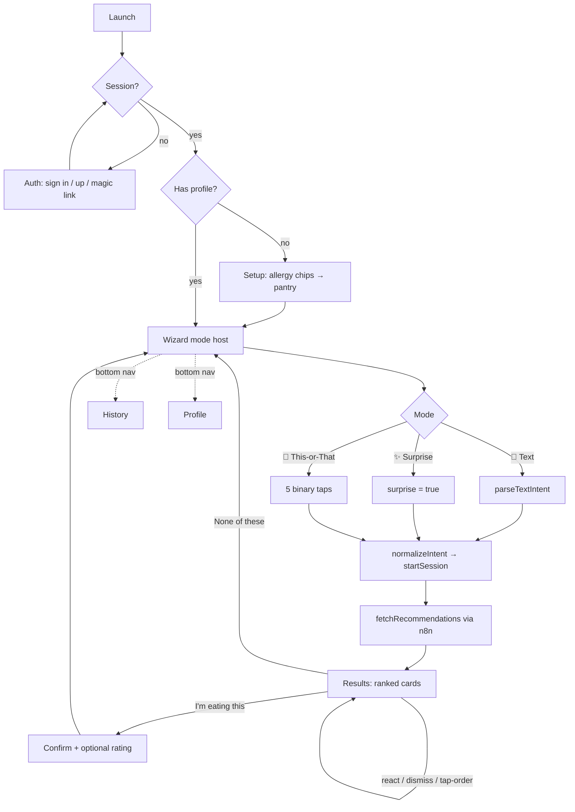

# i'm hungry — Design & User Flow

**Companion to:** `ImHungry_PRD.md` (product requirements)
**Scope:** the full design language + every screen-by-screen user flow. The PRD owns *what* and *why*; this doc owns *how it looks* and *how the user moves through it*.
**Source of truth:** brand tokens live in `src/app/globals.css` (`@theme inline`); flows reflect the shipped components under `src/components/`.

---

## 1. Design Principles

1. **No-form-first.** Food decisions are impulsive and emotional — the UI should feel that way. We never open with a long form; even safety capture is reduced to tappable chips.
2. **One decision per screen.** Each step asks for at most one thing. This-or-That goes further: one binary tap per screen.
3. **Confident color blocking.** Lean into solid brand-color fills (lime / orange / raspberry) over all-white minimalism.
4. **Rounded everything.** Pills and lozenges (`--radius-pill: 999px`) on cards, buttons, chips, badges.
5. **Warm, never sterile.** Cream background (never pure white), soft green-tinted shadows, friendly lowercase display type.
6. **Thumb-reachable.** Single-column, mobile-first, `max-w-md` centered, ≥44px touch targets enforced globally in CSS.

---

## 2. Brand Identity

| Attribute | Value |
|-----------|-------|
| **Name / wordmark** | `i'm hungry` — lowercase, Fraunces display |
| **Monogram** | a single lowercase `h` inside a lime circle (app icon / avatar) |
| **Tagline** | **FRESH, FAST & FOR YOU** — uppercase, letter-spaced (`tracking-[0.2em]`), orange |
| **Vibe** | Fresh, organic, playful, food-forward — warm farmers'-market energy, not SaaS |
| **Voice** | Friendly, second-person, lowercase headlines: *"what sounds good?"*, *"here's what we'd eat"*, *"enjoy your pad thai!"* |

---

## 3. Color Palette

Defined once in `src/app/globals.css`; every Tailwind utility derives from these.

| Token | Hex | Tailwind | Primary use |
|-------|-----|----------|-------------|
| Lime / chartreuse | `#C2D72E` | `lime` | Brand blocks, selected chips, active nav dot, time badges (recipe-adjacent), step progress |
| Forest green | `#33530E` | `forest` | Headlines, body text, "I'm eating this" CTA, active switcher |
| Orange | `#F2872E` | `orange` | Tagline, star ratings, recipe time badges, "View recipe", This-or-That right tile |
| Raspberry / magenta | `#C8265B` | `raspberry` | Primary CTAs, "★ community" rating badge, error tints, hunger/urgency |
| Cream | `#FBF3E7` | `cream` | App background (warm off-white — never pure white) |
| Soft white | `#FFFFFF` | `card` | Card surfaces against cream |

**Supporting effects (tokens):** `--shadow-soft` and `--shadow-soft-lg` (green-tinted), `--radius-pill: 999px`. Opacity steps of `forest` (`/10`, `/40`, `/60`) carry secondary text and hairline borders.

---

## 4. Typography

| Role | Font | Treatment |
|------|------|-----------|
| Display / wordmark / headings | **Fraunces** (`--font-display`, SOFT + WONK axes) | Bold, rounded, **lowercase**, retro-friendly. Loaded via `next/font/google`. |
| Body / UI | **Inter** (`--font-ui`) | Clean, geometric, legible |
| Labels | Inter, uppercase | Letter-spaced section labels and the tagline |

Global rules: base `16px` (inputs forced to ≥16px to block iOS tap-zoom), `h1–h3` use the display font at `line-height: 1.1`.

---

## 5. Motifs & Component Patterns

- **Chips / pills:** rounded-full, `border-2`. Selected = `bg-lime text-forest` (or raspberry tint for allergies); unselected = `bg-card` with a faint forest outline. Used in setup, dismiss reasons, profile, suggestions.
- **Cards:** `rounded-3xl bg-card p-5 shadow-soft`. Option cards, history rows, the auth card.
- **Primary buttons:** `rounded-full bg-raspberry text-cream` with `shadow-soft`, `active:scale` press feedback.
- **Tiles (mode picker / This-or-That):** big `rounded-3xl` color-blocked blocks (lime / orange / raspberry) with an emoji + lowercase display label.
- **Emoji as functional iconography:** 🛵 delivery · 🍳 cook/recipe · ✨ surprise · 🔀 this-or-that · 💬 text · ❤️🙂😐👎 reactions · ⏱ time · ★ rating · 🎉 confirm.
- **Motion:** every `<main>` plays `fadeSlideIn` (0.18s opacity + 6px rise) on mount; skeletons `pulse`; buttons `active:scale-[0.98–0.99]`.
- **Safe area:** bottom nav uses `pb-safe` (`env(safe-area-inset-bottom)`).

---

## 6. Navigation Model

```
AppRouter (auth + profile gate)
 ├─ loading  → Splash ("Warming up the kitchen…")
 ├─ auth     → AuthScreen
 ├─ setup    → SetupFlow            (signed in, no profile yet)
 └─ wizard   → AppShell             (signed in, has profile)
                ├─ 🏠 Home    → Wizard (mode host → results → confirm)
                ├─ 📋 History → History
                └─ 👤 Profile → Profile
```

- **Routing is derived, not pushed.** `AppRouter` computes the route from `(sessionChecked, session, profileFor)` each render — no `setState`-in-effect, and it never `await`s inside the `onAuthStateChange` callback (deadlock guard).
- **Bottom nav** (`BottomNav.tsx`) is fixed, 3 tabs, forest-on-cream; the active tab scales its emoji and shows a lime underline dot. Present only inside `AppShell`.

---

## 7. In-Depth User Flows

### 7.1 Auth (`AuthScreen.tsx`)

- Centered on cream: lime monogram circle (`h`) → `i'm hungry` wordmark → orange uppercase tagline.
- White card with a **pill segmented control**: `Sign In` / `Sign Up` (active = forest fill).
- Email + password fields (rounded, focus-ring switches border to lime). Raspberry submit; label adapts: *Sign in* / *Create account* / *Send magic link*.
- **Magic-link toggle** at the bottom swaps the password field out and switches the action to `signInWithOtp`.
- **States:** inline raspberry error tint (bad credentials); lime info tint for *"check your email to confirm"* (sign-up with confirmation on) and *"magic link sent"*.
- **Exit:** on success, `onAuthStateChange` fires → `AppRouter` re-derives route. This screen never routes itself.

### 7.2 First-run setup (`SetupFlow.tsx`)

Shown only when a signed-in user has **no** `user_profiles` row. Two steps, lime progress bars.

- **Step 0 — safety (required):** *"anything we should always avoid?"* — 8 chips (Vegetarian, Vegan, Gluten-Free, Dairy-Free, Nut allergy, Shellfish allergy, Halal, Kosher) plus **None**. Selecting any clears None and vice-versa. `Continue` is disabled until something is chosen. Allergy chips land in `allergies`, the rest in `dietary_restrictions` — both **hard filters, captured once, never inferred**.
- **Step 1 — pantry (optional):** *"what's usually in your kitchen?"* — 8 chips (Eggs, Pasta, Rice, Canned goods, Bread, Frozen, Cheese, Chicken). Two exits: **"All set — let's eat"** (saves pantry) or **"Skip for now"** (saves empty pantry).
- **On finish:** `user_profiles.upsert` with diet/allergies/pantry + `budget_range: 'medium'`; `onComplete()` flips the router to the wizard.
- **Escape hatch:** a quiet "Sign out" link at the bottom of both steps.
- **Soft taste prefs are never asked here** — they're learned later from feedback.

### 7.3 The decision wizard — mode host (`Wizard.tsx`)

The wizard is a **host**, not a form. It has three phases: `pick → results → confirm`.

- **Open behavior:** reads `user_profiles.last_input_mode`; if it's one of the three modes, it opens **straight into that mode**. First-ever session (or after an explicit reset) shows the **picker**.
- **Picker:** header *"what should you eat?"* + 3 stacked color-blocked tiles:
  - 💬 **Tell us** — lime — "Type what sounds good"
  - ✨ **Surprise me** — raspberry — "Zero input — just decide"
  - 🔀 **This or that** — orange — "Quick taps, no typing"
- **Persistent switcher:** once in a mode, a row of 3 round emoji buttons stays at the top (active = forest fill) so the user can change modes anytime.
- **Hand-off contract:** each mode emits a `ModeOutput` → `normalizeIntent()` → `startSession()` (writes a `food_sessions` row, stamps `day_of_week`/`hour_of_day`, remembers `last_input_mode`, returns `session_id`) → `fetchRecommendations()`. Modes **never** call the engine directly.

#### Mode: 💬 Text (`ModeText.tsx`)
*"what sounds good?"* — autofocused textarea + 4 tappable suggestion chips (*something spicy and fast*, *cheap comfort food*, *light and healthy*, *surprise me*). Raspberry **"Find me food"** (shows *"Thinking…"* while parsing). Text resolves through `parseTextIntent()` — a local heuristic today, a swappable Claude/n8n seam. *"surprise me"* short-circuits to `{ surprise: true }`.

#### Mode: ✨ Surprise Me (`ModeSurprise.tsx`)
Big ✨, *"surprise me"*, one raspberry **"Decide for me"** button → emits `{ surprise: true }`. Zero input; the engine decides from context (time/day) + history. Simplest mode — proves the whole pipeline.

#### Mode: 🔀 This-or-That (`ModeThisOrThat.tsx`)
Five rapid binary rounds with progress dots; each tap auto-advances and the last one submits. Two big tiles per round (left = lime, right = orange):

| Round | Left → | Right → |
|-------|--------|---------|
| 1 | 🍕 Pizza → craving `pizza` | 🍜 Noodles → craving `noodles` |
| 2 | 🔥 Hot → craving `warm` | 🧊 Cold → craving `cold` |
| 3 | 🍳 Cook → `format_pref: cook` | 🛵 Order → `format_pref: order` |
| 4 | ⚡ Quick → `time: 15` | 🕯️ Leisurely → `time: 60` |
| 5 | 💸 Cheap → `budget: low` | ✨ Treat → `budget: high` |

Every choice's label is appended to `raw_input` (joined by ` · `) for audit + learning.

### 7.4 Results (`Results.tsx`)

Header *"here's what we'd eat — Pick one, or skip them all."*

- **Loading:** 3 pulsing skeleton cards.
- **Error:** raspberry tinted panel + **"Try again"** (re-runs the engine with the same intent).
- **Cards** (each shows cuisine tag, time badge, and a rating badge):
  - **Delivery (`🛵`):** cost range, lime time badge, **DoorDash** (raspberry) + **UberEats** (outline) deep links opening in a new tab → fire `tap_order`.
  - **Recipe (`🍳`):** orange time badge, **"View recipe"** accordion → first expand fires `expand_recipe`; steps render as a numbered list with lime number bullets.
  - **Rating badge:** neutral `★ N.N` for external; raspberry **`★ community N.N`** when `source === first_party`, with a tooltip of the vote count.
- **Per-card feedback (`FeedbackControls`):** reaction row ❤️🙂😐👎 (selected = lime, scaled up) · **"Not this"** reveals dismiss-reason chips (*too expensive* / *not in the mood* / *ate recently* / *just dismiss*) · forest **"I'm eating this! 🎉"**.
- **Dismiss** hides that card locally and logs `feedback(outcome: dismissed)` (+ reason).
- **"None of these"** → `skipAll` (`feedback.skipped_all`) + a `reroll` event, returns to the picker.
- **Choose** → logs `time_to_decision`, writes `feedback(outcome: chose)`, advances to confirm.

### 7.5 Confirm (`ConfirmScreen.tsx`)

🎉 *"enjoy your [dish]!"* + an **optional** 1–5 star row (orange fill on hover/select). Submitting writes `feedback.rating` and aggregates a `first_party` row into `ratings` (so the dish can flip to "★ community" next time). **"Skip"** dismisses without rating. Either way → back to the picker.

### 7.6 History (`History.tsx`)

*"what you've eaten"* — last 30 days (limit 60), grouped under **Today / Yesterday / Mon D** headers.

- Each row: the originating **mode emoji** (💬/✨/🔀), the chosen **dish** (or italic *"skipped all options"*), a cuisine tag, a 🛵 delivery / 🍳 cooked marker, the time, and a star rating if one was given.
- **Loading:** 3 skeleton rows. **Empty:** 🍽️ *"no meals yet — make your first decision."*

### 7.7 Profile (`Profile.tsx`)

*"your profile"* with the `h` monogram + tagline. Sections render only when populated:

- **Allergies (hard filter)** — raspberry chips
- **Dietary restrictions** — neutral chips
- **Cuisines you love** — lime chips (*learned*)
- **Not for you** — neutral chips (*learned dislikes*)
- **Pantry staples** — neutral chips
- **Default budget** — neutral chip

Footnote: *"Taste preferences are learned automatically from your choices."* Bottom: **Sign out**. (Editing these is Phase 7 — Preference Management.)

---

## 8. Interaction States (global conventions)

| State | Pattern |
|-------|---------|
| Loading (data) | Pulsing skeleton cards/rows matching the final layout |
| Loading (action) | Button label swaps to a gerund (*Thinking… / Deciding… / Saving… / One sec…*) and disables |
| Error | Raspberry-tinted panel/inline message; destructive actions never auto-retry silently |
| Empty | Centered emoji + lowercase display headline + one-line nudge |
| Success / confirm | 🎉 celebration screen, optional follow-up (rating) that is always skippable |
| Disabled | `opacity-40/60`; primary CTAs gate on the minimum required input |

---

## 9. End-to-End Flow



Signals captured along the way feed the learning loop (see PRD §11): explicit (`feedback`) and implicit (`interaction_events`: `tap_order`, `expand_recipe`, `reroll`, `time_to_decision`).
